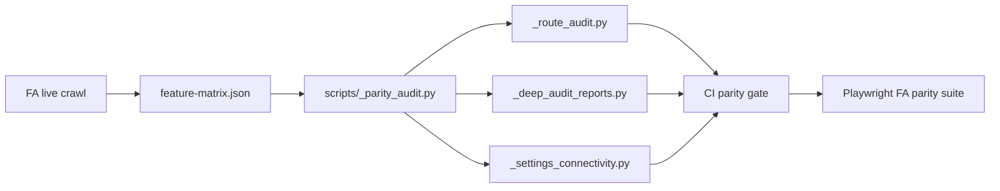

# FastAccounts → AI-Accounts: Full Parity Implementation Plan

**Created:** 2026-05-24  
**Authority:** `FAST-ACCOUNTS-FEATURE-CATALOG.md` (every §1–§16 feature)  
**Companion:** `FINAL-PARITY-PLAN.md`, `PARITY-BACKLOG.md`, `scripts/fastaccounts_export/`  
**Definition of done:** Every FA catalog row marked ✅ with automated gate + UAT script evidence.

---

## 1. Definition of “every single feature”

| Layer | Done means |
|-------|------------|
| **Navigation** | FA sidebar + Settings mega-menu link exists and loads a real page (0 catch-all stubs). |
| **CRUD + workflow** | List → add → edit → view → print → void/copy/approve matches FA status model. |
| **GL** | Posting produces balanced journals with correct default nominals; lock date enforced. |
| **Reports** | FA report ID runs with same filter panel semantics; export Excel/print. |
| **Settings** | Each Smart Settings accordion field persists and affects documents. |
| **Integrations** | Production credentials path (not stub) when FA tenant uses the feature. |
| **RBAC** | Role tree verbs match FA submodule rights; gates on all mutators. |
| **Data** | Nafy-Pharma reconcile passes after migration (`_reconcile.py`). |

**Out of scope (commercial FA only):** Public marketing site, certification course, partner portal — not in-app accounting features.

---

## 2. Verification loop (run continuously)



### 2.1 Automated FA inventory (weekly)

1. `python scripts/fastaccounts_export/discover_links.py` — refresh sidebar + settings URLs.
2. `python scripts/fastaccounts_export/export_labeled.py` — sample list columns per module.
3. `python scripts/_parity_audit.py` — diff FA `modules_manifest.py` vs AI routes.
4. `python scripts/_route_audit.py` — 0 stub pages.
5. `python scripts/_deep_audit_reports.py` — every `report_definitions` ID has handler + UI path.

### 2.2 Master feature matrix (single source of truth)

Create `Backend/docs/FA-FEATURE-MATRIX.csv` with columns:

`fa_section | fa_feature | fa_ref | ai_route | ai_api | status | phase | owner | pr_link`

Populate from §3 below; update on every PR. **Target: 100% ✅ before v1.0 parity release.**

### 2.3 UAT scripts (Playwright)

| Script | FA flow covered |
|--------|-----------------|
| `e2e/parity/sales-cycle.spec.ts` | Quotation → SO → SI → SR allocate → customer statement |
| `e2e/parity/purchase-cycle.spec.ts` | PO → GRN → VI → VP allocate → supplier statement |
| `e2e/parity/bank-cycle.spec.ts` | Payment, receipt, transfer, reconcile, statement import |
| `e2e/parity/gl-cycle.spec.ts` | Journal, TB, P&L, BS, lock date block |
| `e2e/parity/settings.spec.ts` | Smart settings save affects new SI |
| `e2e/parity/reports.spec.ts` | Top 20 FA report IDs return rows |

---

## 3. Master feature checklist (FA catalog → status → phase)

Legend: ✅ Done | ⚠️ Partial | ❌ Missing

### §1 Product entry & tenancy

| Feature | Status | Phase |
|---------|--------|-------|
| Sign up / login / forgot password | ✅ | — |
| Company list / switch company | ✅ | — |
| Admin vs standard user types | ✅ | — |
| Subscription packages / seat limits | ✅ Stripe stub/live + seat limits on invite | P9 |
| API users + OTP + IP restrict | ✅ Invite OTP + per-member IP allowlist | P9 |
| Google Sign-In | ❌ | P9 |
| 2FA | ❌ | P9 |
| Developer API keys UI | ❌ | P9 |

### §2 Global navigation

| Feature | Status | Phase |
|---------|--------|-------|
| Dashboard widgets (§10.9) | ✅ | P4 polish |
| Bank (6 sidebar items) | ✅ 6 items + recon session | P2 spot-check |
| Sales (6 + doc types) | ✅ activity filters + batch SI | P2 spot-check vs FA export |
| Purchases (6 + doc types) | ✅ activity filters + batch bills | P2 spot-check vs FA export |
| Inventory (Products, Adj, Transfer) | ✅ | — |
| Inventory (Landed cost, LC) | ❌ | P3 |
| Reports hub tree | ✅ shortcuts + FA modules + full catalog modes | P6 |
| Analytical Reports hub | ✅ dedicated routes for all seeded analytical defs | P6 |
| Assembly (sidebar vs Stock) | ✅ under Stock | — |
| Header: tasks, support, quick add | ✅ | — |

### §3 Cross-cutting

| Feature | Status | Phase |
|---------|--------|-------|
| Smart Settings (19 accordions §12.2) | ✅ all accordions persist + runtime rules | P4 |
| Auto voucher / journal numbers | ✅ | — |
| Smart Filter 1–4 / Smart Doc 1–4 | ✅ labels on SI/VI/SR/VP/bank forms | P4 Smart Doc depth optional |
| Transaction templates | ✅ SI/VI/bank payment/receipt/journal save/load | P2 |
| Recurring transactions (full) | ✅ CRUD + run-due (SI/bills batch) | P2 |
| Draft / approve workflow | ✅ draft create + approve/post guards + threshold policies | P2 |
| User log (audit) | ✅ View deep links on key doc types | P4 |
| Attachments (all FA doc types) | ✅ bank payment/receipt/transfer + journal + trade docs | P2 |
| Email invoice / SMS | ✅ / ❌ | P5, P10 |
| Print templates (all codes §12.1) | ✅ settings + print routes | P6 PDF |
| Excel import (bank vouchers, journals, SI, customers, stock) | ✅ import jobs: masters, opening_stock, product_tax_update, journals, bank EP/IR, SI/SR/VI/VP + postGl | P2, P7 |
| Copy document (SI, journal, bank payment) | ✅ | P2 |
| Batch SI / batch bills | ✅ | P2 |
| Column / content / filter management | ✅ content settings hub + listing catalog API | P4 |
| Projects / locations on lines | ✅ masters | P2 line UX |
| GST / ADT / FED / WHT on lines | ✅ GST (SI) + ADT/FED (VI) + WHT (SR/VP) | P2 spot-check |
| Multi-currency / FX / revaluation | ✅ bank currency + FX reval page | P2 |
| Lock date global + per-user | ✅ | P2 |
| FIFO allocation | ✅ | — |
| Distribution pricing (margin, trade offer, area qty) | ❌ | P8 |
| FBR digital invoicing | ✅ stub + PRAL live when FBR_PRAL_* configured | P5 |
| Online payments PayPro/Kuickpay | ✅ checkout + webhook; live when PAYPRO_*/KUICKPAY_* configured | P5 |
| Emails add-on automation | ❌ | P5 |

### §4 Bank

| Feature | Status | Phase |
|---------|--------|-------|
| Account balances | ✅ | — |
| Bank payments (multi-line nominal) | ✅ | — |
| Bank receipts | ✅ | — |
| Transfers | ✅ | — |
| Reconciliation (tick/clear session) | ✅ tick/clear/auto-match/complete | P2 |
| Import statement | ✅ | — |
| Excel voucher import | ✅ import jobs EP/IR | P2 |
| Revaluation | ✅ page | P2 wizard |
| Multi-currency bank setup | ✅ currency on bank account | P2 |

### §5 Sales

| Feature | Status | Phase |
|---------|--------|-------|
| Customers (master + import) | ✅ import jobs | P7 |
| Quotations | ✅ | — |
| Sales orders (lifecycle) | ✅ | — |
| Sales invoices | ✅ | P2 tax depth |
| Sales credits (SC) | ✅ | — |
| Delivery notes GDNSI/GDNSO | ✅ | — |
| PDC received | ✅ | P2 reversal |
| Sales receipts + allocation | ✅ | P2 WHT advance |
| Sales All unified list | ✅ server filters + UI | P2 |
| Customer ledger / performance reports | ✅ AR/AP aging, statements, 047/067/182 + extended sales | P6 |
| Email invoice | ✅ SI detail email + settings toggle | P5 |
| POS mode | ❌ | P8 |

### §6 Purchases

| Feature | Status | Phase |
|---------|--------|-------|
| Suppliers | ✅ | P7 import |
| Purchase orders | ✅ | — |
| Supplier bills (VI) | ✅ | P2 tax |
| Supplier credits (VC) | ✅ | — |
| Supplier payments + allocation | ✅ | — |
| PDC issued | ✅ | P2 |
| GRN PO/VI | ✅ | — |
| Purchases All | ✅ server filters + UI | P2 |
| Supplier notify email/SMS | ❌ | P5 |

### §7 Inventory

| Feature | Status | Phase |
|---------|--------|-------|
| Products (master, UOM, batches) | ✅ | P7 bulk |
| Stock adjustment / transfer | ✅ | — |
| Landed cost | ❌ | P3 |
| Letter of credit | ❌ | P3 |
| Projects (inventory entry) | ✅ settings | — |
| Multi-unit full matrix | ✅ UOM UI + report 181 | P8 |
| Batch & expiry on transactions | ✅ schema + goods issue | P2 |
| Opening stock bulk import | ✅ import jobs opening_stock + migration script | P7 |
| Bundle products | ❌ | P8 |
| Product bulk tax update | ✅ import jobs product_tax_update | P7 |

### §8 Fixed assets

| Feature | Status | Phase |
|---------|--------|-------|
| Asset register | ❌ | P3 |
| Depreciation run | ❌ | P3 |
| Disposal + GL | ❌ | P3 |
| Import/export assets | ❌ | P3 |
| FA reports category | ❌ | P3, P6 |

### §9 GL, journals, budget

| Feature | Status | Phase |
|---------|--------|-------|
| Chart of account / sections / nominals | ✅ PATCH/move + bulk delete unused | P2 |
| Journals (add/reverse) | ✅ add/reverse/edit/copy/bulk delete/excel import | P2 |
| Budget module | ✅ CRUD | P3 reports |
| Taxes and year end (§12.12) | ✅ | P2 ADT/FED rows |
| Lock date | ✅ global + per-user UI | P2 |

### §10 Reports

| Feature | Status | Phase |
|---------|--------|-------|
| §10.11 Sales and Customer (22 reports) | ✅ all 22 IDs → dedicated pages or statements | P6 |
| §10.11 Inventory Products (22 reports) | ✅ incl. product activity, stock transfer (206), performance | P6 |
| Favorites star sync | ✅ Smart Settings persist | P6 |
| Bank / Financial / Assembly / Projects / Taxes / Budget / FA / Consolidation trees | ✅ seeded module trees routed (taxes/FA/consolidation N/A until licensed) | P6 |
| Analytical 30+ reports | ✅ all seeded analytical catalog rows dedicated | P6 |
| Report runner (filters, export, drill-down) | ✅ date/export + cell drill-down to docs/GL/statements | P6 |
| Dashboard report deep links | ✅ | — |

### §11 Assembly

| Feature | Status | Phase |
|---------|--------|-------|
| Templates | ✅ | — |
| Jobs (finish, costing) | ✅ | — |
| Assembly reports | ✅ ASM job/templates/WIP/component + bank activity shortcuts | P6 |
| Batch/expiry in assembly | ✅ job batch/expiry + finish upserts ProductBatch | P2 |

### §12 Settings mega-menu

| Feature | Status | Phase |
|---------|--------|-------|
| All §12.1 printing links (SI…Project) | ✅ | — |
| Smart Settings full accordions | ✅ credit limit SI/SO, round-off, template draft, auto codes, last rate, product desc | P4 |
| Business information | ✅ | — |
| Users / roles (expanded trees) | ✅ submodule tree + search + bulk select in role editor | P4, P9 |
| Authorisation policies | ✅ UI | P2 runtime |
| Advance users | ✅ rules UI + customer/supplier/product list filtering | P5 |
| Locations | ✅ | — |
| Dashboard management | ✅ widget gating + settings UI | P4 |
| OP methods | ✅ enabled methods + default payment | P4 |
| Filters / columns / content (Forms, Menu, Listing) | ✅ `/settings/content` hub | P4 |
| Missed recurrence | ✅ | P2 full scheduler |
| Email settings / sent emails | ✅ SMTP settings + sent log grid | P5 |
| User log §12.15 | ✅ View deep links | P4 |

---

## 4. Implementation phases (sequenced)

**Total estimate:** 22–28 weeks (2 full-stack devs parallel) or 14–18 weeks (4 devs).

### Phase 0 — Governance & matrix (Week 1) ✅ ongoing

- [x] Generate `FA-FEATURE-MATRIX.csv` from §3 — `python scripts/_generate_feature_matrix.py`.
- [ ] CI job: fail if matrix has ❌ in **P0–P2** rows for Nafy-Pharma tenant flags.
- [ ] Update `FINAL-PARITY-PLAN.md` status columns after each phase.

### Phase 1 — Pharmacy daily ops depth (Weeks 2–5) **P2**

**Goal:** Nafy-Pharma can run month-end without workarounds.

| # | Deliverable | FA ref |
|---|-------------|--------|
| 1.1 | Sales All / Purchases All — FA filter model (type, date, party, status) | §2.1 |
| 1.2 | ADT + FED + WHT tax legs on SI/VI/SR/VP + Taxes config UI | §3.12, §12.12 |
| 1.3 | Bank reconciliation tick-off UX + complete session | §4.5 |
| 1.4 | Bank Excel voucher import (EP/IR templates) | §3.8, §4 |
| 1.5 | Journal edit/copy; COA nominal edit + move | §9.1, §9.2 |
| 1.6 | Per-user lock date UI + enforcement | §9.5 |
| 1.7 | Attachments on bank payments/receipts/transfers + journals | §3.5 |
| 1.8 | Authorisation runtime gates on all post routes | §12.6 |
| 1.9 | PDC dedicated reversal flows | §5.7, §6.1 |
| 1.10 | Copy SI / bank payment / journal actions | §3.9 |

**Acceptance:** UAT parity scripts green; TB matches FA export for Nafy-Pharma lock date.

### Phase 2 — Smart Settings & admin fidelity (Weeks 6–8) **P4**

| # | Deliverable | FA ref |
|---|-------------|--------|
| 2.1 | Smart Settings UI — all 19 accordions (§12.2.1) | §12.2 |
| 2.2 | Smart Filter/Doc labels on all sales/purchase/bank forms | §3.1 |
| 2.3 | Auto-code blocks (customer, supplier, product, nominal, tax codes) | §12.2.8 |
| 2.4 | E-signatures table | §12.2.4 |
| 2.5 | Product description column matrix | §12.2.5 |
| 2.6 | Template/draft matrix + last rate matrix | §12.2.6–7 |
| 2.7 | Content Settings — Forms + Menu branches | §12.14 |
| 2.8 | Unify Filters / Columns / Content (single listing engine) | §12.1 footnote |
| 2.9 | Dashboard Management ↔ live dashboard widget gating | §10.9 |
| 2.10 | OP Methods — map FA options from live tenant | §12.1 |
| 2.11 | User log Type enum + View → document deep link | §12.15 |
| 2.12 | Roles — fully expanded permission trees per submodule | §12.4 |

### Phase 3 — Documents & scheduling (Weeks 9–11) **P2**

| # | Deliverable | FA ref |
|---|-------------|--------|
| 3.1 | Transaction templates (save/load on SI, VI, bank) | §3.3 |
| 3.2 | Recurring transaction scheduler (not only missed) | §3.3 |
| 3.3 | Batch sales invoice screen | §3.9, §5.4 |
| 3.4 | Batch supplier bills screen | §3.9, §6.3 |
| 3.5 | Two-copy print for SR and VP | §3.7 |
| 3.6 | Customer advance return flow | §5.8 |
| 3.7 | Supplier advance return flow | §6.4 |
| 3.8 | Batch/expiry selection on SI/VI lines | §7.8 |

### Phase 4 — Reports & analytics (Weeks 12–15) **P6**

| # | Deliverable | FA ref |
|---|-------------|--------|
| 4.1 | Import full §10.10 / §10.11 report IDs into `report_definitions.py` | §10 |
| 4.2 | Reports hub UI — full FA tree (expand/collapse + search) | §10.10 |
| 4.3 | Wire every ID to handler or explicit “not licensed” | §10.11 |
| 4.4 | Analytical hub — all categories + favorites spelling | §10.3 |
| 4.5 | Report criteria panels per FA (status, type, category filters) | §10.12 |
| 4.6 | `POST /reports/runs/{id}/export` in UI | §10 |
| 4.7 | Hyperlinked drill-down from report cells | §3.10 |
| 4.8 | Budget vs actual reports (after P3 budget reports) | §9.3 |
| 4.9 | Optional server-side PDF pipeline | §3.7 |

**Acceptance:** `_deep_audit_reports.py` — 0 missing handlers; top 50 FA reports match row counts vs export sample.

### Phase 5 — FA add-on modules (Weeks 16–20) **P3**

Build only if `module-subscriptions` enables (mirror FA licensing):

| Module | Schema | API | UI | Reports |
|--------|--------|-----|-----|---------|
| **Fixed assets** | `FixedAsset`, depreciation schedules | CRUD + run + dispose | `/inventory/fixed-assets` or `/assets` | FA category |
| **Landed cost** | allocation headers/lines | allocate to GRN/VI | wizard | LC in inventory |
| **Letter of credit** | LC register, drawdowns | full lifecycle | `/inventory/lc` | LC reports |
| **Consolidation** | company group | consolidate TB | settings | Consolidation tree |
| **Advance users** | visibility rules | filter masters/lists | `/settings/advance-users` | — |
| **Budget reports** | uses existing Budget | compare actuals | extend `/settings/budget` | Budget category |

### Phase 6 — Integrations production (Weeks 18–21) **P5**

| Integration | Work |
|-------------|------|
| **FBR/PRAL** | Live API, credential vault, retry queue, SI submit from detail |
| **PayPro / Kuickpay** | Production checkout, webhook → auto SR + FIFO |
| **Email add-on** | SMTP/SES, triggers (balance, receipt, payment), throttling |
| **Sent emails** | Full outbound log (not invite-only) |
| **SMS** | Provider integration + credit balance (if licensed) |

### Phase 7 — Import / export parity (Weeks 20–22) **P7**

| Import | FA template |
|--------|-------------|
| Customers Excel | §5.1 |
| Products + opening stock | §7.1 |
| Sales invoices + receipts Excel | §5.4, §5.8 |
| Supplier bills Excel | §6.3 |
| Journals Excel | §3.8 |
| Bank payments/receipts Excel | §3.8 |
| Role import/export | ✅ exists — extend |
| Fixed asset import | §8 |

### Phase 8 — Auth, API, commercial (Weeks 22–24) **P9**

- Google OAuth, TOTP 2FA
- API user type + key issuance + OTP confirm
- IP allowlist on all API paths
- `require_module_access` on **every** mutator (audit script)
- Stripe production billing (if SaaS scope)

### Phase 9 — Distribution & pharmacy extras (Weeks 24–26) **P8**

Only if FA tenant uses them (verify on Nafy-Pharma Smart Settings):

- Retail margin, trade offer, customer-product discounts
- Width × length → area quantity
- Bundle product explosion
- Customer also supplier
- User fixed sale rates
- POS invoice mode
- Schedule 3 / distribution invoice templates
- Multi-unit price matrix on products

### Phase 10 — Hardening & sign-off (Weeks 26–28)

- Full Playwright parity suite in CI
- Performance: report pagination on 7k+ invoices
- Security review: RBAC, lock date, authorisation
- **Sign-off checklist:** `FA-FEATURE-MATRIX.csv` 100% ✅
- Nafy-Pharma: `_reconcile.py` + trial balance vs FA export
- Update `MIGRATION-AUDIT.md` + retire stub flags

---

## 5. Parallel workstreams

| Stream | Owner focus | Phases |
|--------|-------------|--------|
| **A — Ops & GL** | Bank, sales, purchases, tax, posting | 1, 3 |
| **B — Settings & RBAC** | Smart settings, users, authz | 2, 8 |
| **C — Reports** | Definitions, hub UI, analytical | 4 |
| **D — Add-ons** | FA modules gated by subscription | 5 |
| **E — Integrations** | FBR, payments, email, SMS | 6 |
| **F — QA/CI** | Matrix, audits, Playwright | 0, 10 |

---

## 6. Nafy-Pharma fast path (if time-boxed)

If full §8–§9 add-ons are **not licensed** in FA, defer Phase 5 rows for: Fixed assets, LC, Landed cost, Consolidation, SMS, Advance users.

**Minimum for go-live parity (8 weeks):** Phase 0 + Phase 1 + Phase 2 (Smart Settings core) + Phase 4.1–4.3 (top 40 reports used by pharmacy) + FBR if required.

Verify licensed modules:

```powershell
# Compare FA Smart Settings "Others" toggles + module-subscriptions in export
python scripts/fastaccounts_export/analyze_labels.py
```

---

## 7. Ticket naming convention

```
[P{phase}-{AREA}-{seq}] Title
  FA: §x.y reference
  Matrix row: FA-FEATURE-MATRIX.csv#line
  API: OpenAPI operationId
  UI: route path
  Test: script name
  Done: matrix ✅ + UAT green
```

Example: `[P2-BANK-03] Bank reconciliation tick-off session`

---

## 8. Immediate next actions (this week)

1. ~~**Generate `FA-FEATURE-MATRIX.csv`**~~ — `scripts/_generate_feature_matrix.py` → `Backend/docs/FA-FEATURE-MATRIX.csv`.
2. ~~**Phase 1.1 Sales/Purchases All filters**~~ — server `dateFrom`/`dateTo`/`partyId`/`docType`/`status` + UI (`activity-list-filters.tsx`).
3. **Start Phase 1.2** — ADT/FED/WHT schema on line tables + posting legs.
4. **Re-run FA discover_links** after any FA UI update.
5. **Assign streams A–F** if multiple developers.

---

## 9. References

| Doc | Purpose |
|-----|---------|
| `AI-ACCOUNTS-PARITY-STATUS.md` | **Living summary — done vs remaining** (migration, phases, blockers) |
| `FAST-ACCOUNTS-FEATURE-CATALOG.md` | Complete FA feature spec |
| `FINAL-PARITY-PLAN.md` | Prior phased plan (update as phases close) |
| `PARITY-BACKLOG.md` | Open ticket index |
| `PRINT-EXPORT-MATRIX.md` | Print/export coverage |
| `scripts/fastaccounts_export/modules_manifest.py` | FA sidebar module keys |
| `scripts/_route_audit.py` | Zero stub gate |

---

## 10. Double-check audit (2026-05-24)

Automated gates run on this date:

| Gate | Result |
|------|--------|
| `_route_audit.py` | **38/38** nav + **56/56** settings + **29/29** report shortcuts — **0 stub pages** |
| `_parity_audit.py` | **24/24** FA §2.1 sidebar routes have pages |
| `_deep_audit_reports.py` | **84/84** `report_definitions` rows have SQL handlers; **0** unmapped catalog IDs |
| FA export (`fastaccounts_labeled_data.json`) | **28** sidebar/settings modules exported (see §10.2) |

### 10.1 Confirmed complete (navigation shell)

All FA §2.1 sidebar items plus AI extras (quotations, credits, GRN, delivery notes, assembly, FX reval) have real pages. Settings §12.1 mega-menu is **fully wired** including printing matrix (22 codes), Budget, Authorisation, Locations, Projects.

### 10.2 Export coverage gap (data, not UI)

These FA modules are **not** in the labeled export JSON — re-run export if migration spot-checks need them:

`dashboard`, `stock_transfer`, `reports`, `analytical_reports`, `settings_nominals`

### 10.3 Items missing from original §3 checklist (now tracked)

| FA ref | Feature | Phase |
|--------|---------|-------|
| §12.4.2 | **Vehicles** RBAC module | P5 or defer if unlicensed |
| §12.5 | **Advance Users** — needs `/settings/advance-users` | P5 |
| §3.6 | **SMS module** (credits, triggers) — separate from email | P6 |
| §12.1 rail | **Dark mode** toggle | P4 chrome |
| §15 | **Notifications bell** | P4 chrome |
| §1.4 | **API keys** developer UI (distinct from users) | P9 |
| §4.1 | **Credit-card-style** bank ledgers | P2 |
| §5.1 | **Customer–product lines** (rate/qty/discount per customer) | P8 |
| §5.1 | **Customer also supplier** flag | P2 |
| §7.1 | **Bundle products** (explode on invoice) | P8 |
| §7.1 | **8 flexible product fields** on transactions | P4 |
| §7.1 | **Archive/inactive** products | P2 |
| §5.3 | **Multiple SOs → one SI**; partial conversion | P2 |
| §5.4 / §6.3 | **Edit after partial payment** rules | P2 |
| §3.12 | **Sales tax amount override** on lines | P2 |
| §3.12 | **Schedule 3** vs inline invoice templates | P8 |
| §3.17 | **Width × length → area** quantity | P8 |
| §12.2.2 | **POS invoices** mode | P8 |
| §12.2.2 | **Fine daily / fine percentage** late payment | P4 |
| §12.2.4 | **E-signatures** table | P4 |
| §9.1.4 | Section listing **PDF/Excel export** | P2 |
| §5.7 / §6.1 | **PDC bounce/reversal** (beyond present/clear) | P2 |
| §10.10.1 | Reports hub UI: **Budget, Fixed Assets, Consolidation, LC** categories | P6 |

### 10.4 “Has route, not yet FA-faithful” (behavior gaps)

These pages exist but **workflow depth** still differs from FA — covered in Phases 1–4:

- Smart Settings — 20 accordions, most fields not persisted per §12.2
- Sales All / Purchases All — server filters ✅; FA export spot-check still P2
- Bank reconciliation — ✅ session tick/clear/auto-match/complete + doc links
- ADT/FED/WHT — on VI/SR/VP lines ✅; SI GST ✅; spot-check vs FA P2
- Authorisation — ✅ threshold policies on SI/VI/SR/VP/bank/journal post
- Journals / COA — ✅ journals + nominal PATCH/move/bulk delete unused
- Reports — handlers exist for 84 IDs; **FA hub tree** shows ~200+ leaves with filter panels
- FBR / PayPro / Email — **stub** production paths
- Recurrence — ✅ scheduler CRUD + run-due (SI/bills batch)
- Attachments — ✅ on bank vouchers, journals, and trade documents

### 10.5 AI-only settings (keep; not FA parity blockers)

Invite templates, Learning, What's New, module subscriptions/access, custom fields, report catalog in settings — product enhancements beyond FA §12.1.

---

*This plan targets **100% FA in-app feature parity**. Update §3 status columns as work completes; strike items in PARITY-BACKLOG.md with PR links.*
