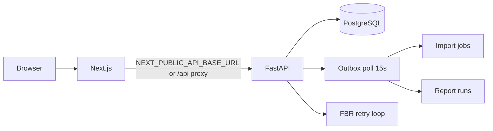

# Production deployment checklist

Use this after code is ready and migrations are tested locally. For **first production deploy**, start with [DEPLOY-QUICKSTART.md](./DEPLOY-QUICKSTART.md). For **Nafy-Pharma** tenant verification, run [GO-LIVE-RUNBOOK.md](./GO-LIVE-RUNBOOK.md) against production (or staging with production-like data).

---

## Architecture

| Component | Role |
|-----------|------|
| **Frontend** (Next.js) | UI; in production must reach API via `NEXT_PUBLIC_API_BASE_URL` or same-origin reverse proxy |
| **Backend** (FastAPI + uvicorn) | `/api/v1/*`, JWT auth, Prisma, background outbox/FBR retry loops |
| **PostgreSQL** (Supabase) | Runtime: transaction pooler `:6543`; migrations/scripts: session pooler `:5432` (`DIRECT_URL`) |



---

## 1. Database

- [ ] Create Supabase project (or managed Postgres).
- [ ] **Runtime** `DATABASE_URL`: transaction pooler port **6543**, include `pgbouncer=true` and `connection_limit=1` per [Backend README](../README.md).
- [ ] **Migrations** `DIRECT_URL`: session pooler port **5432** (same user/password, URL-encoded).
- [ ] From `Backend/` with venv active:

```powershell
$env:PYTHONPATH = "src"
.\.venv\Scripts\python scripts/migrate_deploy.py
.\.venv\Scripts\python -m prisma generate
```

- [ ] Do **not** use `npx prisma migrate` — see [MIGRATIONS.md](./MIGRATIONS.md).

---

## 2. API (Backend) — required env

Set in host secret store (Railway, Fly, Azure, etc.). Copy from [`.env.example`](../.env.example) or [`.env.production.example`](../.env.production.example).

| Variable | Production |
|----------|------------|
| `DATABASE_URL` | Supabase **6543** pooler URL |
| `JWT_SECRET_KEY` | Random ≥32 chars; **never** default `dev-secret-change-me` |
| `CORS_ORIGINS` | Comma-separated frontend origins, e.g. `https://app.yourdomain.com` |
| `APP_PUBLIC_URL` | Public frontend URL (password reset, invites), e.g. `https://app.yourdomain.com` |
| `AUTH_EXPOSE_OTP_IN_RESPONSE` | **`false`** |
| `BREVO_API_KEY` + `BREVO_SENDER_EMAIL` | Verified sender for OTP / reset emails |
| `OUTBOX_POLL_ENABLED` | **`1`** (default) — processes import jobs and async report runs |

### API — recommended

| Variable | Notes |
|----------|--------|
| `ACCESS_TOKEN_EXPIRE_MINUTES` / `REFRESH_TOKEN_EXPIRE_DAYS` | Tune for security policy |
| `OTP_TTL_MINUTES` | Default 15 |
| `ATTACHMENT_UPLOAD_DIR` | Persistent volume path if not using object storage |
| `DATABASE_READ_URL` | Optional read replica for heavy reports |

### API — integrations (enable when credentials exist)

| Variable | UI surface |
|----------|------------|
| `FBR_PRAL_ENABLED`, `FBR_PRAL_API_URL`, `FBR_PRAL_API_KEY` | Settings → FBR errors; auto-retry when `FBR_RETRY_ENABLED=true` |
| `PAYPRO_*` | Settings → Online payments; webhook `POST .../payments/paypro/webhook` |
| `KUICKPAY_*` | Optional second provider |

Verify without secrets: `GET /api/v1/companies/{id}/integrations/readiness` or  
`python scripts/fastaccounts_migrate/_integrations_readiness.py`.

### API — optional

| Variable | Notes |
|----------|--------|
| `GROQ_API_KEY` | In-app assistant; disable with `GROQ_ENABLED=false` if unused |
| `CLICKHOUSE_URL` | Analytics export only |
| `STRIPE_*` | Billing webhooks if subscriptions are live |

### Process model

- Run **one** uvicorn worker per instance (Supabase session limits).
- Example:

```bash
cd Backend && PYTHONPATH=src uvicorn app.main:app --host 0.0.0.0 --port 8000
```

- Health: `GET /health`
- Manual outbox drain (debug): `POST /api/v1/companies/{company_id}/platform/process-outbox` (authenticated)

---

## 3. Frontend — required env

| Variable | Production |
|----------|------------|
| `NEXT_PUBLIC_API_BASE_URL` | Public API origin, e.g. `https://api.yourdomain.com` **no trailing slash** (see [`Frontend/.env.production.example`](../../Frontend/.env.production.example)) |

**Why:** Next.js dev rewrites (`/api/v1` → backend) are **disabled** in production (`next.config.mjs`). Without this variable, the browser calls same-origin `/api/v1`, which only works if your reverse proxy forwards `/api/v1` to the API.

### Deployment patterns

**A — Split hostnames (typical)**  
- Frontend: `https://app.example.com`  
- API: `https://api.example.com`  
- Set `NEXT_PUBLIC_API_BASE_URL=https://api.example.com`  
- Set `CORS_ORIGINS=https://app.example.com`

**B — Single hostname (nginx / Cloudflare)**  
- Proxy `/api/v1/*` → Backend, everything else → Next.js  
- Leave `NEXT_PUBLIC_API_BASE_URL` unset; browser uses same-origin  
- `CORS_ORIGINS` can be the single site URL or omitted if truly same-origin

Build:

```bash
cd Frontend
npm ci
npm run build
npm run start   # or platform start command
```

### CDN / static asset caching

`Frontend/next.config.mjs` sets `Cache-Control` response headers for static assets. Configure your CDN or reverse proxy origin rules to match:

| Path | Cache-Control | CDN action |
|------|---------------|------------|
| `/_next/static/*` | `public, max-age=31536000, immutable` | Cache at edge (long TTL) |
| `/brand/*`, `/favicon.ico` | `public, max-age=86400, stale-while-revalidate=604800` | Cache at edge (1 day) |
| `/api/v1/*` (same-origin proxy) | `private, no-store` | **Bypass cache** |
| HTML app routes | Next.js default / `private, no-cache` | Bypass cache |

**Important:** Never CDN-cache authenticated tenant API responses. Backend reference GETs use `Cache-Control: private, max-age=300` for browser disk cache only (per-user, not shared at edge).

---

## 4. Post-deploy verification

1. **Env gate (before deploy):** `python scripts/_prod_env_check.py --strict` or `.\scripts\deploy-preflight.ps1 -Strict`
2. **Smoke:** `python scripts/_post_deploy_smoke.py --api-url https://<api-host>`
3. **Login:** open frontend, sign-in with Brevo OTP.
4. **Tenant gates** (migrated Nafy): from repo root with `Backend/.env` pointing at prod/staging DB:

```powershell
python scripts/fastaccounts_migrate/_go_live_check.py
```

5. Review `Backend/docs/GO-LIVE-SIGNOFF-LATEST.md` — required: preflight, reconcile, TB = **PASS**; AR/AP may be **REVIEW** on summary GL.
6. **Optional UI:** `cd Frontend && npx playwright test e2e/parity/smoke.spec.ts`  
   Authenticated parity: set `PLAYWRIGHT_AUTH_READY=1` and credentials per `Frontend/e2e/README.md`.

---

## 5. Security checklist

- [ ] `JWT_SECRET_KEY` rotated; not in git
- [ ] `AUTH_EXPOSE_OTP_IN_RESPONSE=false`
- [ ] Database credentials only in server env (never in Frontend)
- [ ] PayPro/Kuickpay webhook secrets set; restrict `*_WEBHOOK_ALLOWED_IPS` when provider publishes ranges
- [ ] HTTPS everywhere; HSTS on frontend
- [ ] File upload directory not world-writable; backups for Postgres

---

## 6. Operational notes (Nafy-Pharma)

| Item | Guidance |
|------|----------|
| Tenant ID | `cmpfm1nst0001lhq3rz09938z` |
| Draft SI/VI | ~47 + ~17 expected; post individually in UI when appropriate |
| Bulk post script | **Do not** run `_bulk_post_drafts.py` without `--i-understand-summary-gl-risk` and ops approval |
| Party aging vs FA | **REVIEW** until open-item GL rebuild |
| Parity tracker | [AI-ACCOUNTS-PARITY-STATUS.md](./AI-ACCOUNTS-PARITY-STATUS.md) |

---

## 7. Rollback

1. Redeploy previous API + Frontend artifacts.
2. DB schema rollback: only if a migration was applied in this release — use `prisma migrate resolve` per [MIGRATIONS.md](./MIGRATIONS.md); avoid destructive SQL on production without backup.
3. Re-run `_go_live_check.py` after any data fix.

---

## 8. Reference stack (Vercel + Railway)

Common split-host setup:

| Service | Host | Notes |
|---------|------|--------|
| Frontend | [Vercel](https://vercel.com) | Root: `Frontend/`; `vercel.json` included; env `NEXT_PUBLIC_API_BASE_URL` |
| API | [Railway](https://railway.app) | Root: `Backend/`; `Dockerfile` + `railway.toml`; health `/health` |
| Database | Supabase | Runtime URL on Railway; migrations via `releaseCommand` or manual |

**Repo artifacts:** `Backend/Dockerfile`, `Backend/railway.toml`, `Frontend/vercel.json`

**Railway env (minimum):** `DATABASE_URL` (6543 pooler), `DIRECT_URL` (5432 for release migrations), `JWT_SECRET_KEY`, `CORS_ORIGINS`, `APP_PUBLIC_URL`, `BREVO_*`, `OUTBOX_POLL_ENABLED=1`

**Vercel env:** `NEXT_PUBLIC_API_BASE_URL=https://<railway-app>.up.railway.app`

**Deploy order:** push → Railway build (release runs `migrate_deploy.py`) → smoke `GET /health` → Vercel frontend → login OTP test → go-live workflow or `_go_live_check.py`

**Local Docker smoke (optional):**

```powershell
cd Backend
docker build -t ai-accounts-api .
docker run --rm -p 8000:8000 --env-file .env ai-accounts-api
```

**PayPro webhook:** point provider to `https://<api-host>/api/v1/companies/{company_id}/payments/paypro/webhook` (public HTTPS required).

**FBR before PRAL credentials:** leave `FBR_PRAL_ENABLED=false` — submissions use **stub mode** (`FBR-STUB-*` references) for UAT; enable PRAL when sandbox/production keys are ready.

---

## 9. CI and automated gates

On every push/PR, [`.github/workflows/ci.yml`](../../.github/workflows/ci.yml) runs:

- Backend `pytest` with `SKIP_PRISMA=1`
- Frontend typecheck, lint, production build
- FA feature matrix drift check
- Backend Docker build + `/health` smoke
- E2E parity smoke (API + Next.js + Playwright)

**Manual go-live** (staging/production DB): Actions → **Go-live verification** → set tenant id → requires repository secrets:

| Secret | Value |
|--------|--------|
| `DATABASE_URL` | Runtime or session pooler URL for scripts |
| `DIRECT_URL` | Session pooler `:5432` (preferred for scripts) |

Optional env override: `GO_LIVE_COMPANY_ID` (defaults to Nafy tenant).

---

## Related docs

| Doc | Purpose |
|-----|---------|
| [GO-LIVE-RUNBOOK.md](./GO-LIVE-RUNBOOK.md) | Tenant verification order |
| [GO-LIVE-SIGNOFF-LATEST.md](./GO-LIVE-SIGNOFF-LATEST.md) | Last automated sign-off |
| [MIGRATIONS.md](./MIGRATIONS.md) | Prisma deploy |
| [Backend README](../README.md) | Local dev, Brevo, pooler URLs |
| [scripts/README.md](../../scripts/README.md) | Verification scripts |
